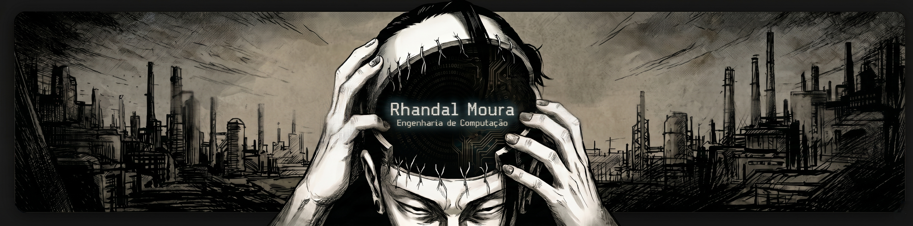

  

 

    

---
<h2 style="border-bottom: none; padding-bottom: 0;">👨🏻‍💻 SOBRE MIM</h2>

  👩‍🎓 <strong>Técnico em Internet das Coisas (IoT)</strong> pelo IFTM.

  🎓 <strong>Graduando em Engenharia de Computação</strong> pela Uniube.

  🚀 Atualmente focado em <strong>integração de hardware e visão computacional</strong> em projetos institucionais.

### 🤖 Linguagens e Tecnologias

    
 

 
 

## 📊 Minhas Estatísticas do GitHub

    

    

